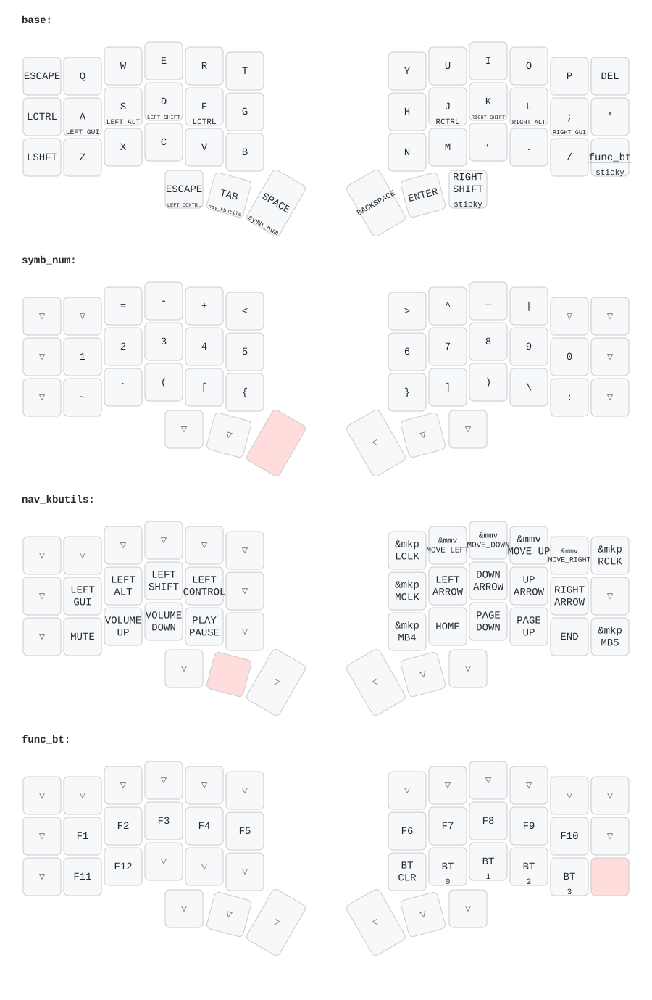

# ZMK Config

Based on [markstos](https://mark.stosberg.com/markstos-corne-3x5-1-keyboard-layout/)'s layout and [n3oney](https://github.com/n3oney/zmk-config/tree/0d531c7962dd495252d1567d91d65f225604c4f7)'s layout with a few changes:

